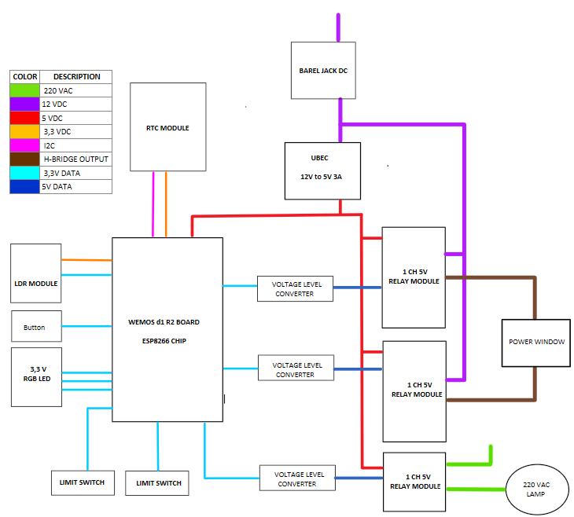
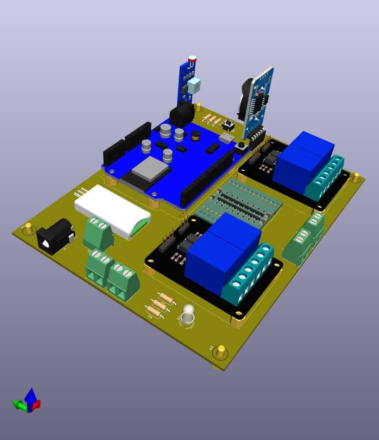
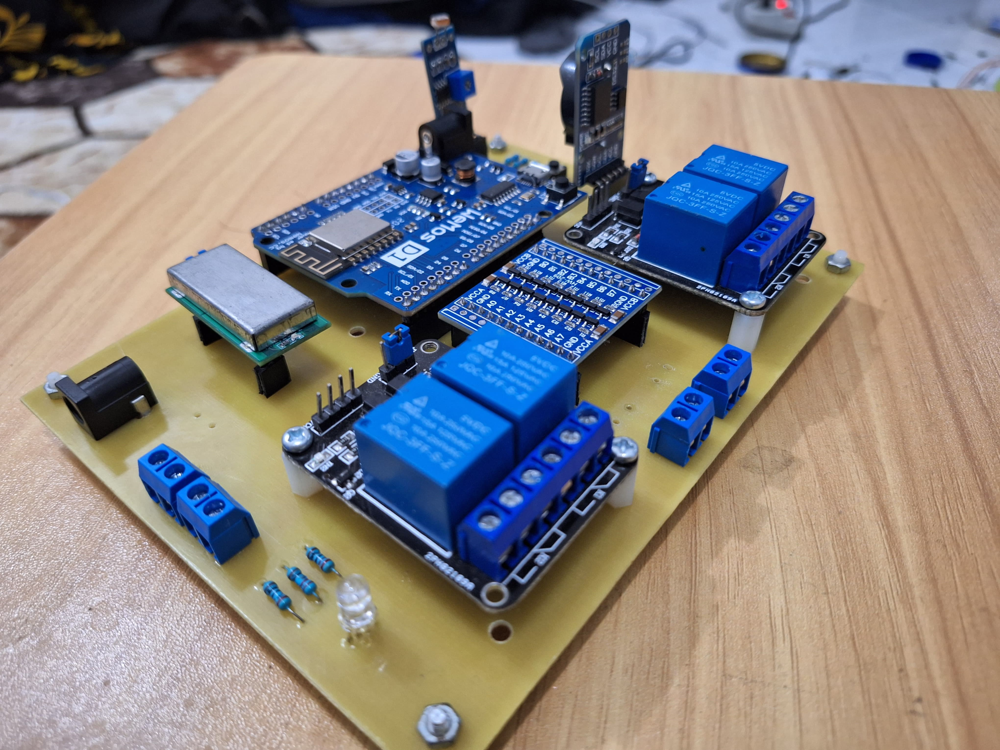
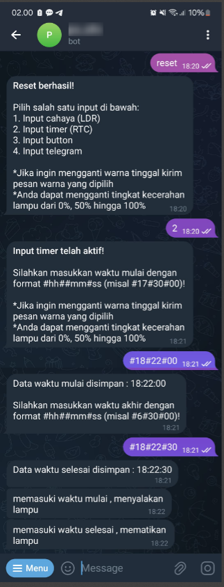

# IoT Device for Curtain Motor and RGB Nightlight Control

This project demonstrates an IoT device that controls a curtain motor and an RGB nightlight (used as a sleep lamp). The device is powered by an ESP8266 microcontroller and uses the Universal Telegram bot library for remote control. The system offers four different modes of operation for flexible and convenient usage.

## Features

- **ESP8266-Based Control**: Utilizes the ESP8266 microcontroller for wireless communication and control.
- **Telegram Bot Integration**: Allows remote control via a Telegram bot.
- **Four Operation Modes**:
  1. **Button Control**: Manually control the curtain motor and RGB nightlight using physical buttons.
  2. **LDR Control**: Automates control based on ambient light levels using an LDR (Light Dependent Resistor).
  3. **Time-Based Control**: Schedules operations using a Real-Time Clock (RTC).
  4. **Direct Telegram Control**: Sends commands directly through Telegram for real-time control.

## Hardware Specification

*Figure 1: Electronics Diagram*

## Images

*Figure 2: 3D Looks Board Design*

*Figure 3: Real Board*

*Figure 4: Usage*

## Usage

1. **Button Control**: Press the respective physical buttons to control the curtain motor and RGB nightlight.
2. **LDR Control**: The device will automatically control the lamp based on the ambient light detected by the LDR.
3. **Time-Based Control**: Set the desired schedules using the RTC module to automate operations.
4. **Telegram Control**: Send commands via Telegram to control the device remotely.
